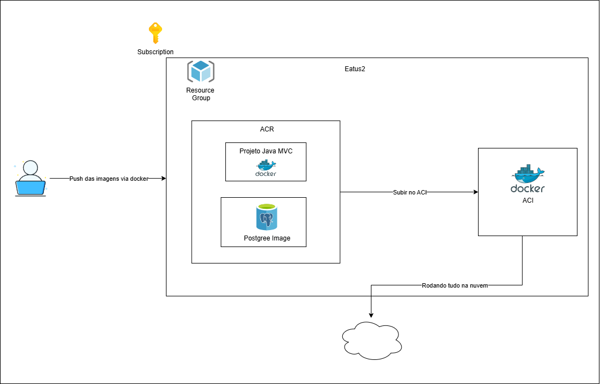

# 🏍️ Vroom

Vroom é um projeto desenvolvido para gerenciar estacionamentos de motocicletas, permitindo o cadastro de veículos, o acompanhamento de vagas e monitorar o problema do veículo. O sistema combina componentes de hardware, software e banco de dados para otimizar o controle e a identificação de veículos de maneira prática e eficaz.

---

## 👤 Integrantes

- Guilherme Guimarães - RM557074 / 2TDSA
- Matheus Oliveira de Luna - RM555547 / 2TDSA
- Gabriel Marcello Cândido Freire - RM556783 / 2TDSPW

---

## 🛠️ Descrição do Projeto

A proposta do projeto é desenvolver uma solução tecnológica voltada para otimizar a organização e o monitoramento de motocicletas em pátios, tornando a gestão e a identificação dos veículos mais ágil e precisa. Para isso, o sistema contará com a integração de diferentes componentes, como Arduino, um aplicativo móvel e um banco de dados centralizado.

A solução contará com pequenas placas eletrônicas, denominadas **Tags**, que serão fixadas em cada motocicleta. Cada Tag será equipada com:

- 🔊 Um **buzzer** para sinalização sonora;
- 💡 Um **LED** para indicação visual;
- 🧲 Um **ímã** que permitirá uma fixação prática e segura na moto.

Ao chegar ao pátio, cada motocicleta terá seus dados, como **placa, chassi e informações sobre eventuais problemas**, registrados em um banco de dados. Essas informações poderão ser consultadas por meio de uma **API desenvolvida em Java**.

Além disso, os funcionários responsáveis pelo controle e monitoramento das motocicletas no pátio terão acesso a um **aplicativo móvel integrado ao banco de dados**.

Com ele será possível:
- 📋 Consultar informações detalhadas de cada moto, como placa, chassi e problemas registrados;
- ✏️ Alterar ou atualizar os dados das motocicletas conforme necessário;
- 🔔 Acionar o buzzer da motocicleta selecionada, emitindo sinais sonoros;
- 🌈 Visualizar no LED a cor correspondente ao problema da moto.

Essa solução tem como objetivo **facilitar a localização rápida das motocicletas no pátio**, reduzindo o tempo gasto na identificação dos veículos e garantindo uma gestão mais eficiente.

---

## 🎯 Objetivo

- Garantir uma gestão mais organizada e eficiente;
- Reduzir o tempo necessário para a identificação dos veículos pelos funcionários;
- Tornar mais rápida e prática a localização das motos no pátio.

---

## 🚀 Tecnologias Utilizadas

- ☕ **Java 21**
- 🌱 **Spring Boot**
- 🗃️ **Spring Data JPA**
- 🔐 **Spring Security**
- 🎨 **Thymeleaf**
- 🐘 **PostgreSQL**
- 🪶 **Flyway**
- 🐳 **Docker / Docker Compose**
- ⚡ **Gradle**

---

## 📋 Requisitos Para Execução

Antes de executar a aplicação, certifique-se de ter instalado:

- [Java 21](https://www.oracle.com/java/technologies/downloads/)
- [Docker](https://www.docker.com/)
- [Git](https://git-scm.com/)

---

## ▶️ Como Executar o Projeto

1. **Dar permissão de execução para os scripts usando o Git bash**:
   ```bash
   chmod +x scripts/*.sh
   ```

2. **Construir a imagem Docker e enviar para o Azure Container Registry (ACR):**
   ```bash
   ./scripts/build.sh
   ```

3. **Implantar no Azure Container Instances (ACI):**
   ```bash
   ./scripts/deploy.sh
   ```

📌 *A execução deve seguir exatamente essa ordem.*

---

## 🗂️ Diagrama da Solução

📌 O diagrama completo está disponível dentro do projeto:



---

## 🎥 Demonstração no YouTube

📌 O vídeo de execução da aplicação está disponível em:

👉 [Assista à Demonstração no YouTube] https://youtu.be/zGbTBPeroA4

---

## 🌐 Acesso à Aplicação em Produção

Após o deploy, a aplicação estará disponível no seguinte endereço:

👉 [Link para acessar a aplicação Vroom] http://aci-app-vroom-rm557074.eastus.azurecontainer.io:8080/

---

## 📌 Observações

- O projeto foi desenvolvido para rodar na **nuvem Azure** utilizando **ACR (Azure Container Registry)** e **ACI (Azure Container Instances)**.
- O banco de dados utilizado é o **PostgreSQL em nuvem**, garantindo persistência dos dados.
- Toda a aplicação é containerizada, seguindo boas práticas de **DevOps**.
